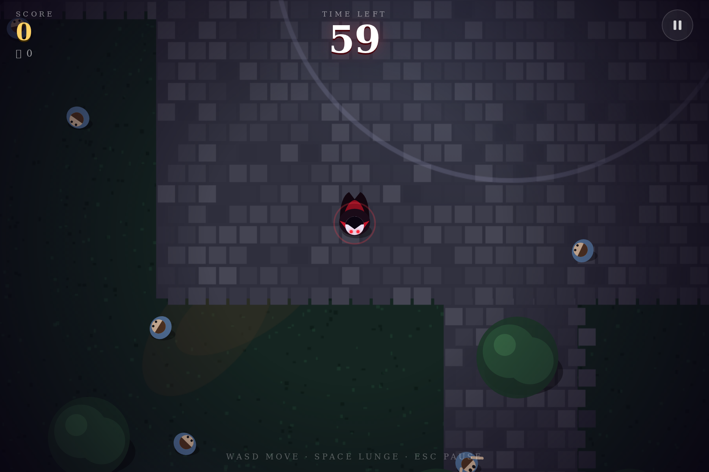
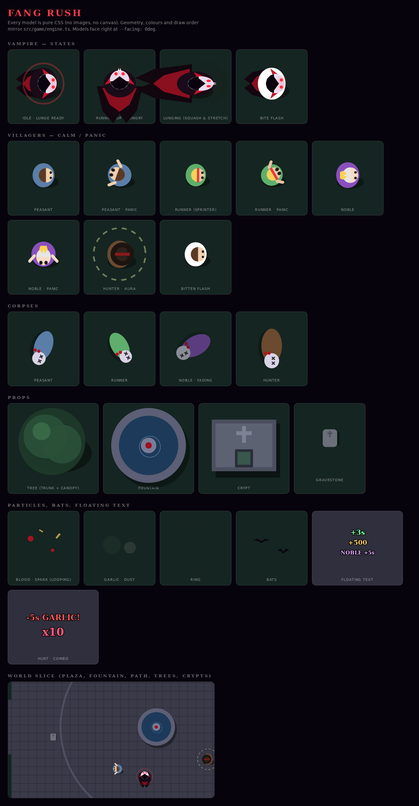

# Fang Rush (Vampus)

> **You have 60 seconds to live. Every bite buys +3 s. Feast.**

A top-down vampire arcade game for the browser — React 19, TypeScript, Vite, Tailwind 4, Canvas 2D, procedural WebAudio. No assets, no backend; the production build is a single `index.html`.



## Play

```bash
npm ci
npm run dev        # → http://localhost:5173
```

| | Keyboard | Touch |
|---|---|---|
| Move | `WASD` / arrows | drag anywhere |
| Lunge | `Space` / `Shift` / `J` `K` `X` | fang button, 2nd finger, double-tap |
| Pause | `P` / `Esc` | pause button |
| Mute | `M` | speaker button |

Bite villagers to gain time, chain bites within 2.6 s for up to ×10, and **lunge into hunters** (touching one otherwise costs 5 s).

## Scripts

| Command | Does |
|---|---|
| `npm run dev` / `build` / `preview` | Vite |
| `npm run typecheck` | `tsc --noEmit` |
| `npm run docs:check` | fails if `docs/css/tokens.css` drifts from the game code |
| `npm run docs:contrast` | WCAG contrast table for the palette |

## Documentation

| Doc | Contents |
|---|---|
| [docs/GAME_DESIGN.md](docs/GAME_DESIGN.md) | Concept, pillars, rules, every number, controls, juice, audio, flow, tech |
| [docs/DESIGN_SYSTEM.md](docs/DESIGN_SYSTEM.md) | Brand, colour, type, motion, components, model construction, a11y contract |
| [docs/css/tokens.css](docs/css/tokens.css) | Design tokens (primitive → semantic → gameplay) |
| [docs/css/models.css](docs/css/models.css) | Vampire, villagers, corpses, props, particles, FX, world — **as pure CSS** |
| [docs/css/components.css](docs/css/components.css) | Buttons, panels, HUD, tabs, table, input… |
| `docs/css/*-preview.html` | Open in a browser to see every model / component |
| [docs/REVIEW.md](docs/REVIEW.md) | Audit findings (a11y, code, hygiene) + plan |
| [GLOSSARY.md](GLOSSARY.md), [docs/adr](docs/adr) | Vocabulary and decisions |
| [AGENTS.md](AGENTS.md) | Rules for AI agents working on this repo |



## License
See [LICENSE](LICENSE).
