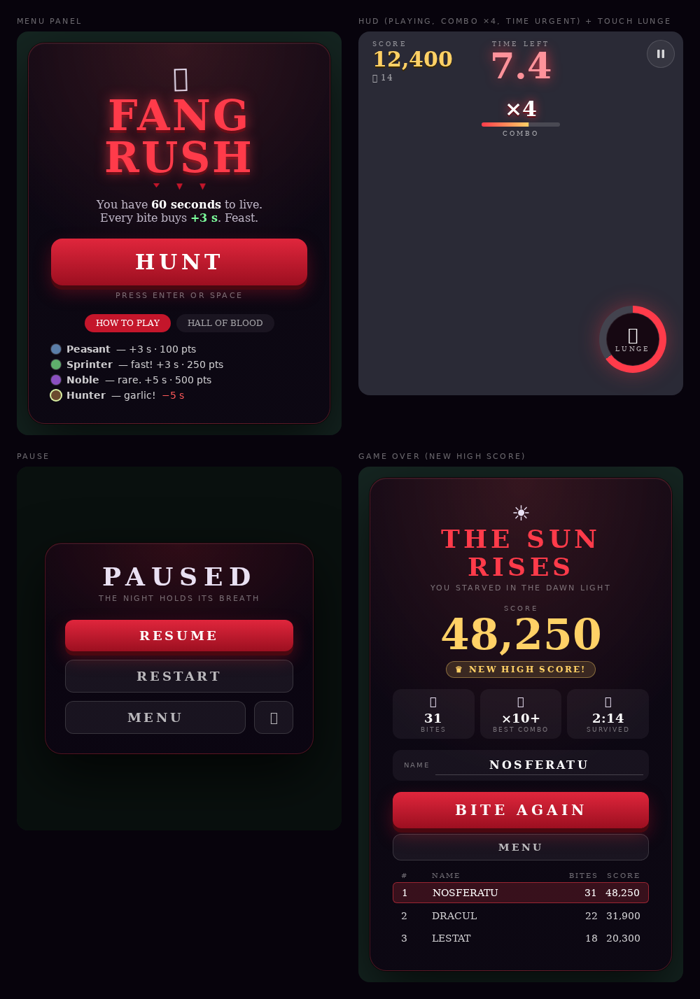

# Fang Rush — Design System

Machine-readable sources (import these, don't retype values):

| File | What it is |
|---|---|
| [`css/tokens.css`](css/tokens.css) | 3-layer design tokens: **primitive → semantic → gameplay** (`--fr-*`). Single source of truth. |
| [`css/models.css`](css/models.css) | Every on-canvas entity as pure CSS (vampire, villagers, corpses, props, particles, FX, world). |
| [`css/components.css`](css/components.css) | Every DOM UI element (buttons, panels, HUD, tabs, table, input…). |
| `css/models-preview.html`, `css/components-preview.html` | Visual galleries (open in any browser). |
| [`../scripts/verify-docs.mjs`](../scripts/verify-docs.mjs) | `npm run docs:check` — fails when tokens drift from `engine.ts` / `index.css`. |



---

## 1. Design read (taste-skill §0)

> *Reading this as: **browser arcade game** for **casual mobile + desktop players**, with a **gothic-pulp, neon-blood-on-black** language, leaning toward **native CSS tokens + Tailwind utilities + canvas**.*

| Dial (taste-skill) | Value | Why |
|---|---|---|
| `DESIGN_VARIANCE` | **4** | Symmetric, centred panels; the canvas provides the chaos. |
| `MOTION_INTENSITY` | **8** | Flicker, drip, pop, shake, hit-stop — motion is the product. Must be paired with a reduced-motion path. |
| `VISUAL_DENSITY` | **3** | Airy overlays so the playfield stays visible. |

**Anti-default discipline.** No AI-purple mesh, no Inter + slate. The palette is *blood on ink* with *one* reward colour (gold) and *one* gain colour (mint green). The one "purple" is semantic (noble = rare).

**One brand idea.** *Hunger.* Everything red is cost/danger/brand, everything gold is reward, everything green is time gained.

---

## 2. Colour

Semantic roles (see `tokens.css` for the full primitive list):

| Role | Token | Hex | Used for |
|---|---|---|---|
| Page / canvas clear | `--fr-surface-page` | `#07030c` | `html`, theme-color, canvas background |
| Brand red | `--fr-p-blood-600` | `#c4162b` | collar, active tab, dripping blood |
| Bright red | `--fr-p-blood-400` / `--fr-text-brand` | `#ff3b4a` | title, urgent timer, lunge ring, rings FX |
| Button gradient | `--fr-gradient-btn` | `#e0263c → #9c0f20` | primary CTA |
| Hard shadow | `--fr-p-blood-950` | `#4a0810` | button lip, text hard-shadows |
| Reward gold | `--fr-text-reward` | `#ffd166` | score, sparks, badges, combo ≥ 10 bar end |
| Gain green | `--fr-text-gain` | `#7cff9c` | "+time" |
| Loss red | `--fr-text-loss` | `#ff5a5a` | "−5 s" |
| Bone | `--fr-text-primary` | `#e9e0f2` | body text, vampire skin |
| Victim keys | `--fr-victim-*` | `#5b7ea8 #5fae6c #8a4fbf #6b4a2f` | sprite bodies **and** legend dots |

**Contrast** — computed by [`scripts/contrast.mjs`](../scripts/contrast.mjs) (WCAG 2.x relative luminance, panel base `#0c0512`):

| Pair | Ratio | Verdict |
|---|---|---|
| bone `#e9e0f2` on panel | 15.69 : 1 | AAA |
| gold `#ffd166` on panel | 13.92 : 1 | AAA |
| gain green `#7cff9c` on panel | 15.91 : 1 | AAA |
| loss red `#ff5a5a` on panel | 6.56 : 1 | AA |
| blood-bright `#ff3b4a` on panel | 5.71 : 1 | AA |
| white/80 · /60 · /50 on panel | 12.68 · 7.31 · 5.32 : 1 | AAA · AAA · AA |
| white on brand red `#c4162b` (active tab) | 6.01 : 1 | AA |
| white on button gradient end `#9c0f20` | 8.39 : 1 | AAA |
| **white/40 on panel** (captions, 9–11 px) | **3.74 : 1** | ❌ fails AA for small text |
| **white/35 on panel** (desktop key hints) | **3.12 : 1** | ❌ fails AA for small text |
| **white/30 on grass** (HUD key hint) | **2.68 : 1** | ❌ decorative only |

Fix: raise small captions to `white/55` or brighter (≥ 4.5 : 1) — tracked in REVIEW.md.

---

## 3. Typography

| Role | Font | Weight | Size / tracking |
|---|---|---|---|
| Display (title, numbers, buttons, HUD) | **Cinzel** → Georgia → Times → serif | 900 (numbers/titles), 700 (ghost buttons), 400 (captions) | title 48/60 px `0.05em`; timer 36/48 px; score 24/30 px |
| Body | system-ui stack | 400/700 | 14 px |
| Caption / eyebrow | system-ui or Cinzel | 400 | 9–11 px, `0.2–0.35em`, uppercase |

Rules: numbers use `font-variant-numeric: tabular-nums` (timer, score, table); all-caps copy carries wide tracking; canvas floating text uses the same Cinzel 900 with a 4 px dark outline (`paint-order: stroke fill` in CSS).

---

## 4. Space, radius, elevation

* **Space**: 4 px base (`--fr-p-space-1…8`), Tailwind-compatible.
* **Radius**: buttons/tiles `12` (`xl`), hero CTA `16` (`2xl`), panels `24` (`3xl`), pills/icon buttons `full`.
* **Elevation**: a *hard lip* (`0 6px 0 #4a0810`) + soft glow for primary buttons (presses down 4 px); panels use a hairline black ring + deep 80 px shadow + 1 px inner highlight. No generic drop-shadow soup.
* **Glass**: panel `backdrop-filter: blur(6px)` over a dimming scrim — functional (keeps the playfield legible), not decorative.

---

## 5. Motion

| Token | Value | Use |
|---|---|---|
| `--fr-p-ease-pop` | `cubic-bezier(.2,.9,.3,1.4)` | score/multiplier pop (0.22 s, scale 1→1.28→1) |
| `--fr-p-ease-rise` | `cubic-bezier(.2,.8,.2,1)` | panel entrance (0.45 s, 18 px rise) staggered 80 ms |
| urgent | 0.5 s ease-in-out ∞ | timer < 10 s |
| flicker | 4 s linear ∞ | title neon glitch at 92–98 % |
| drip / bat-float / shimmer | 2.4 s / 3 s / 2.2 s | menu ornaments, top-score number |
| press | 0.08 s | button down-travel |

Rules: animate `transform`/`opacity` only; explicit transition lists (never `all`); every looping decoration stops under `prefers-reduced-motion` (implemented in `components.css` and `models.css`, **not yet in the shipped `index.css`** — REVIEW #3).

---

## 6. Components (CSS classes → shipped equivalent)

| `components.css` | Shipped | Spec |
|---|---|---|
| `.fr-btn.fr-btn--primary` | `.btn-blood` | gradient, 6 px lip, hover `brightness(1.12)`, active −4 px & smaller lip |
| `.fr-btn.fr-btn--ghost` | `.btn-ghost` | 6 % white fill, 1 px 14 % border, hover 12 %, active −2 px |
| `.fr-panel` | `.panel` | radial wine→ink gradient, 25 % red border, blur 6 |
| `.fr-lunge` | `.lunge-btn` | conic cooldown ring via `--fill` |
| `.fr-hud__*` | `Hud.tsx` | timer/score/combo/pause/lunge layout, safe-area padding |
| `.fr-tile`, `.fr-tile--stat` | move/lunge tiles, stat tiles | 5 % white fill |
| `.fr-tab` | menu tabs | pill; active = `#c4162b` |
| `.fr-dot--*` | `Dot` | 14 px victim legend |
| `.fr-badge` | rank badge | gold 15 % fill, 40 % border |
| `.fr-field` + `.fr-input` | name input | underline input with focus colour **and** [a11y] ring |
| `.fr-scores__*` | `HighScoreTable` | 4-col grid `2rem 1fr auto auto` |

### Component state matrix (design-system skill pattern)

| State | Primary button | Ghost button | Tab |
|---|---|---|---|
| Rest | gradient + 6 px lip | 6 % fill | 6 % fill, 60 % text |
| Hover | `brightness(1.12)` | 12 % fill | 12 % fill |
| Active | translateY 4 px, lip 2 px | translateY 2 px | — |
| Focus-visible | gold 3 px ring **[a11y]** | gold ring | gold ring |
| Selected | — | — | `#c4162b`, white text |
| Disabled | (none used) | (none used) | — |

---

## 7. Model construction rules (how the CSS sprites are built)

1. **r-units.** A model is a `4r × 4r` box; parts are placed by centre `(--x, --y)` and size `(--w, --h)` in multiples of the entity radius `r`. This is the same arithmetic as the canvas code (`r * 0.6`, `hx = r * 0.2`), so a sprite scales by changing `--rn` alone.
2. **Facing right.** `--facing` rotates the `.fr-rot` group — identical to `ctx.rotate(facing)`.
3. **Paint order = DOM order.** First child paints first, exactly as in the canvas functions.
4. **Shadows never rotate.** `.fr-shadow` lives outside `.fr-rot`.
5. **Curves → polygons.** `quadraticCurveTo` paths (cape, bat wings) are sampled at the control points and expressed as `clip-path: polygon()` percentages; the derivation is in the comments.
6. **State by class/custom-property.** `.is-panic`, `.is-flash`, `.is-fangs`, `.is-ready`, `.is-stun`; continuous inputs `--lunge`, `--flare`, `--glow`, `--alpha`, `--facing`.
7. **Colour only via tokens.** No hex in `models.css` except the bat (`#0b0610`, a one-off in the canvas code).

### Vampire anatomy (r = 18, facing →)

| Part | Shape (r-units) | Colour |
|---|---|---|
| Cape | 7-pt polygon, x −1.9…−0.2, flares ×1…1.7 with speed | `#12060f` |
| Cape lining | 5-pt polygon, x −1.4…−0.3 | `#8b0f1f` |
| Body | ellipse 0.95 × 1.1 | `#1a0b18` (white on bite) |
| Collar | two triangles at ±(0.35…1.05) | `#c4162b` |
| Head | disc Ø 1.32 at x 0.25 | `#e9e0f2` |
| Hair | back-half disc + apex | `#0a0410` |
| Widow's peak | rhombus x −0.25…0.5 | `#0a0410` |
| Eyes | 2 × disc Ø 0.22 at (0.67, ±0.24), glow 6–24 px | `#ff2a3c` |
| Fangs | 2 × triangle 0.2 × 0.12 at x 0.97 | `#ffffff` |
| Ready ring | r + 8 px, 2 px, α 0.18–0.34, 1.05 s | `#ff3b4a` |

### Villager anatomy

| Part | Shape (r-units) |
|---|---|
| Body | ellipse 0.9 × 1.0 |
| Head | disc Ø 1.2 at x 0.2 |
| Hair | back half of the head |
| Eyes | 3 px discs (4.4 px when panicking) at (0.6, ±0.22) |
| Arms (panic) | 3.5 px strokes, length 0.78, ±50.2°, head colour |
| Accessory | none / headband 0.22 × 1.24 / crown 7-pt / hat Ø 1.7 + Ø 1.0 + band 1.1 × 0.2 |

---

## 8. Accessibility contract

Shipped vs. target (details and file:line in [REVIEW.md](REVIEW.md)):

| Area | Target | Status |
|---|---|---|
| Keyboard play | full | ✅ WASD/arrows/Space/P/Esc/M |
| Touch alternatives for gestures | tap/click alternative | ✅ dedicated lunge button |
| Icon buttons labelled | `aria-label` | ✅ pause, lunge, mute (emoji glyphs still need `aria-hidden`) |
| Focus visibility | `:focus-visible` ring | ❌ none in shipped CSS → provided in `components.css` |
| Reduced motion | honoured | ❌ shipped; ✅ in `components.css` |
| Pinch-zoom | allowed | ❌ `user-scalable=no` (defensible for a game canvas, not for menus) |
| Live regions for score | `aria-live="polite"` (throttled) | ❌ |
| Photosensitivity | option to cut flashes/shake | ❌ roadmap |
| Colour-only meaning | never | ✅ accessories + aura duplicate colour coding |

---

## 9. Using the system

```html
<link rel="stylesheet" href="docs/css/tokens.css">
<link rel="stylesheet" href="docs/css/components.css">
<link rel="stylesheet" href="docs/css/models.css">
```

```html
<!-- a noble, panicking, facing up-left, anywhere in the DOM -->
<div class="fr-m fr-villager fr-villager--noble is-panic" style="--facing:-135deg">
  <i class="fr-shadow"></i>
  <div class="fr-rot">
    <i class="fr-p fr-villager__body"></i>
    <i class="fr-villager__arm fr-villager__arm--l"></i><i class="fr-villager__arm fr-villager__arm--r"></i>
    <i class="fr-p fr-villager__head"></i><i class="fr-p fr-villager__hair"></i>
    <i class="fr-p fr-villager__acc"></i>
    <i class="fr-villager__eye fr-villager__eye--l"></i><i class="fr-villager__eye fr-villager__eye--r"></i>
  </div>
</div>
```

Re-skinning: change only the `--fr-p-*` primitives. Adding a new victim type: add a `--fr-p-<t>-*` palette block, a `.fr-villager--<t>` modifier (colour + `--rn`), and (optionally) an accessory rule — then extend `TYPE_INFO` in `engine.ts`; `docs:check` will tell you if the two disagree.
